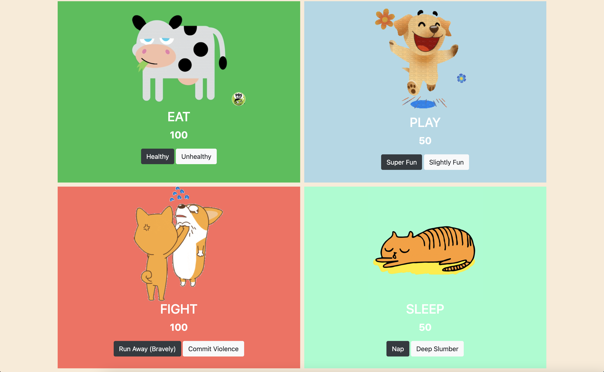

# PROJECT NAME
Tamagotchi
# DATE
3/4/2021
# PROJECT OVERVIEW
Created functionality on page that allows quadrants to be printed to the dom with images and buttons that subtract or add a status to a certain activity.
# HOW TO USE
A user can use all 4 quadrants to eat, play, fight, and sleep with their pet. Click the buttons to start actions that will tell you their progress in that activity.
# SCREENSHOTS

# LOOM VIDEO
https://www.loom.com/share/2c55b17e1f1246cc94e3e0bd57292d6f

# NETLIFY LINK
https://rc-tamagotchi.netlify.app/
